# car-microservice-boot-with-redis-cache


# 🚗 Car Microservice with Redis Cache

This project demonstrates a **Spring Boot microservice** integrated with **MongoDB** for data storage and **Redis** for caching — all orchestrated with **Docker Compose**.

---

## 🧱 Prerequisites

Make sure the following tools are installed on your system:

- [Docker](https://www.docker.com/products/docker-desktop/)
- [Docker Compose](https://docs.docker.com/compose/)
- [Java 17+](https://adoptium.net/)
- [Maven](https://maven.apache.org/)

---

## ⚙️ 1. Build the Spring Boot JAR

```bash
mvn clean package -DskipTests

This will generate a JAR file in the target/ directory:
target/cart-microservice.jar

🐳 2. Start All Services Using Docker Compose
docker-compose up -d --build


This command will:

Build and start the Spring Boot container

Start MongoDB and Redis containers

Create a Docker network:
car-microservice-boot-with-redis-cache_default

🧩 3. Check Running Containers

docker ps

Expected output:

CONTAINER ID   IMAGE                                                             PORTS
xxxxxxxxxxxx   car-microservice-boot-with-redis-cache-combined-cart-ms-service   0.0.0.0:8081->8081/tcp
xxxxxxxxxxxx   mongo:7                                                           0.0.0.0:27017->27017/tcp
xxxxxxxxxxxx   redis:7                                                           0.0.0.0:6379->6379/tcp


🧠 4. Connect to MongoDB Inside Docker Network

docker run -it --rm \
  --network car-microservice-boot-with-redis-cache_default \
  mongo:7 mongosh mongodb://mongodb:27017/combined_cart_db

Sample MongoDB Commands

show collections
db.carts.find().pretty()

✅ Example Output:

[
  {
    "_id": ObjectId("69157926df8fc05e0c39c07d"),
    "userId": "U10011",
    "items": [
      { "itemId": "FL1234", "type": "flight-11", "description": "Bangalore to Kuala Lumpur flight ticket", "price": 31500 },
      { "itemId": "HT4567", "type": "hotel-11", "description": "3-night stay at AirAsia partner hotel", "price": 11200 },
      { "itemId": "AD7891", "type": "addon-11", "description": "Extra baggage 15kg", "price": 1300 }
    ],
    "totalAmount": 44000
  }
]

⚡ 5. Connect to Redis Inside Docker

docker exec -it car-microservice-boot-with-redis-cache-redis-1 redis-cli

Sample Redis Commands

keys *
get cartCache::U10011

Expected output:

1) "CART_U10011"
2) "cartCache::U10011"

🌐 6. Access REST API Endpoints

| Endpoint                   | Method | URL                                           | Description                  |
| -------------------------- | ------ | --------------------------------------------- | ---------------------------- |
| `/api/cart/all`            | GET    | `http://localhost:8081/api/cart/all`          | Fetch all carts              |
| `/api/cart/add`            | POST   | `http://localhost:8081/api/cart/add`          | Add a new item to a cart     |
| `/api/cart/clear/{userId}` | DELETE | `http://localhost:8081/api/cart/clear/U10011` | Clear Redis cache for a user |


🧾 Example Request (POST /api/cart/add)


{
  "userId": "U10011",
  "items": [
    {
      "itemId": "FL1234",
      "type": "flight",
      "description": "Flight ticket Bangalore to KL",
      "price": 31500
    }
  ]
}


🧹 7. Stop and Clean Containers

To stop all running containers and remove the network:

docker-compose down

This will stop and remove:

        MongoDB container

        Redis container

        Spring Boot microservice container

        The Docker network car-microservice-boot-with-redis-cache_default


🧰 8. (Optional) Run Redis Locally (Windows)

If you want to test Redis locally:

redis-server

Then open another terminal and connect:

redis-cli
keys *


✅ Summary

| Component        | Technology              | Purpose                                |
| ---------------- | ----------------------- | -------------------------------------- |
| Backend          | Spring Boot             | REST API for Cart Service              |
| Database         | MongoDB                 | Persistent cart storage                |
| Cache            | Redis                   | Cache cart data to improve performance |
| Containerization | Docker + Docker Compose | Simplified multi-service setup         |


Additional Details:

⚙️ 1️⃣ Maven Build Command
mvn clean package -DskipTests

🔍 What it does:

mvn → Maven command-line tool

clean → Removes the old compiled files from the target/ directory

package → Compiles, runs (optional) tests, and builds the .jar file

-DskipTests → Skips running unit tests during the build

🎯 Why we use it:

You use this to create your deployable Spring Boot JAR file — usually named like:

target/cart-microservice.jar

That JAR is what your Docker container runs.

🐳 2️⃣ Start Containers with Docker Compose


docker-compose up -d --build


🔍 What it does:

docker-compose → Tool that defines and runs multi-container Docker apps using docker-compose.yml

up → Starts all services defined in that file

-d → Runs them in detached mode (in the background)

--build → Forces a rebuild of the images before starting

🎯 Why we use it:

This starts 3 containers:

Spring Boot app container (your cart-microservice.jar)

MongoDB container — used as database

Redis container — used as cache

Docker Compose automatically links them into one network called:
car-microservice-boot-with-redis-cache_default

🧩 3️⃣ Check Running Containers
docker ps

🔍 What it does:

Lists all currently running Docker containers.

🧾 Typical Output:

CONTAINER ID   IMAGE                                                             PORTS
f2fc29f2a3a6   car-microservice-boot-with-redis-cache-combined-cart-ms-service   8081->8081/tcp
66fa5e4f1d18   mongo:7                                                           27017->27017/tcp
ec65398b06fb   redis:7                                                           6379->6379/tcp


🎯 Why we use it:

To verify:

All containers are running properly

Port mappings (e.g. 8081 for app, 27017 for MongoDB, 6379 for Redis)


🧠 4️⃣ Connect to MongoDB Inside Docker Network

docker run -it --rm \
  --network car-microservice-boot-with-redis-cache_default \
  mongo:7 mongosh mongodb://mongodb:27017/combined_cart_db


🔍 Breakdown:

| Part                                                       | Description                                            |
| ---------------------------------------------------------- | ------------------------------------------------------ |
| `docker run`                                               | Start a new temporary container                        |
| `-it`                                                      | Run interactively (terminal mode)                      |
| `--rm`                                                     | Remove container automatically after exit              |
| `--network car-microservice-boot-with-redis-cache_default` | Join the same Docker network as your MongoDB container |
| `mongo:7`                                                  | Use the official MongoDB 7 image                       |
| `mongosh`                                                  | Start the Mongo shell client                           |
| `mongodb://mongodb:27017/combined_cart_db`                 | Connect to the MongoDB instance running inside Docker  |


🎯 Why we use it:

This lets you directly open a Mongo shell that can talk to the running MongoDB container inside the same network

🎯 Why we use it:

This lets you directly open a Mongo shell that can talk to the running MongoDB container inside the same network.

⚡ 5️⃣ Connect to Redis Inside Docker

docker exec -it car-microservice-boot-with-redis-cache-redis-1 redis-cli


🔍 Breakdown:


| Part                                             | Description                                       |
| ------------------------------------------------ | ------------------------------------------------- |
| `docker exec`                                    | Run a command inside an already running container |
| `-it`                                            | Run in interactive terminal mode                  |
| `car-microservice-boot-with-redis-cache-redis-1` | Name of your Redis container                      |
| `redis-cli`                                      | Open the Redis command-line client                |


🎯 Why we use it:

To directly inspect what data is stored in Redis — e.g., cached user cart details.


🌐 6️⃣ Access REST API Endpoints


| Method   | URL                                             | Purpose                               |
| -------- | ----------------------------------------------- | ------------------------------------- |
| `GET`    | `http://localhost:8081/api/cart/all`            | Fetch all cart data from DB           |
| `POST`   | `http://localhost:8081/api/cart/add`            | Add items to a cart                   |
| `DELETE` | `http://localhost:8081/api/cart/clear/{userId}` | Clear Redis cache for a specific user |


Example POST request:


{
  "userId": "U10011",
  "items": [
    {
      "itemId": "FL1234",
      "type": "flight",
      "description": "Flight ticket Bangalore to KL",
      "price": 31500
    }
  ]
}


🎯 Why we use it:

This is how you verify the API functionality — test MongoDB persistence and Redis caching.

🧹 7️⃣ Stop and Clean Containers


docker-compose down


🔍 What it does:

Stops all running containers defined in the docker-compose.yml

Removes:

Containers

The created Docker network

Any temporary resources

🎯 Why we use it:

To clean up and shut down everything after you’re done testing.


✅ Summary of Flow

Build → mvn clean package -DskipTests

Start all services → docker-compose up -d --build

Check containers → docker ps

Connect Mongo → docker run ... mongosh

Connect Redis → docker exec ... redis-cli

Test APIs → via Postman or curl

Clean up → docker-compose down


## Kong gateway-process

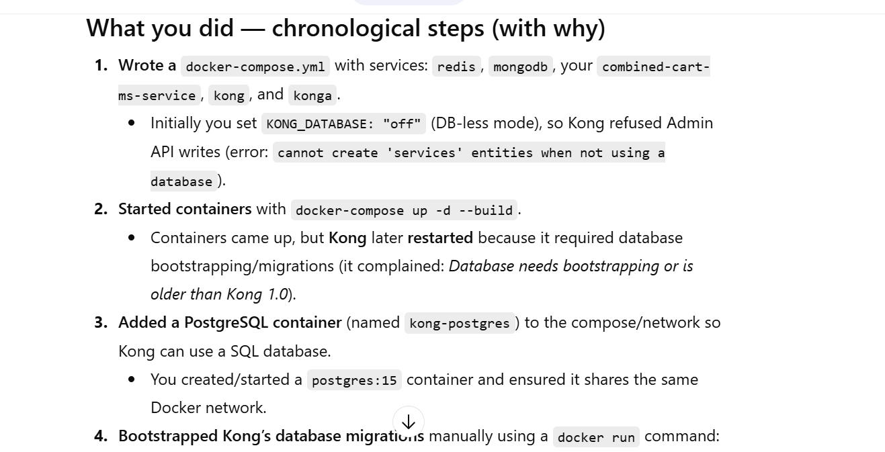
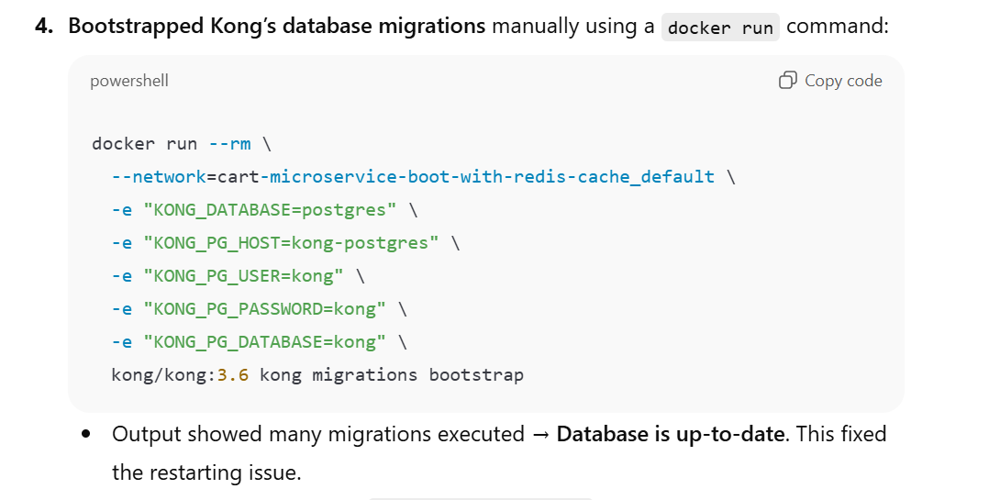
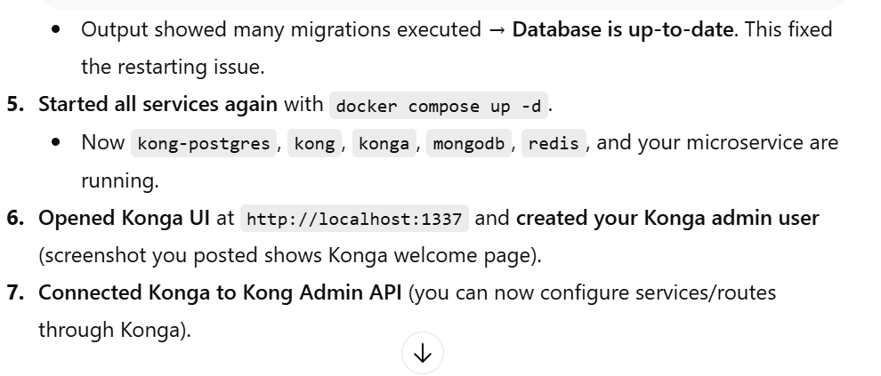
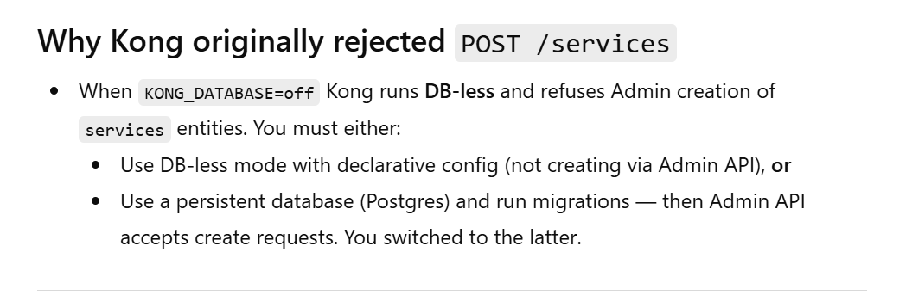
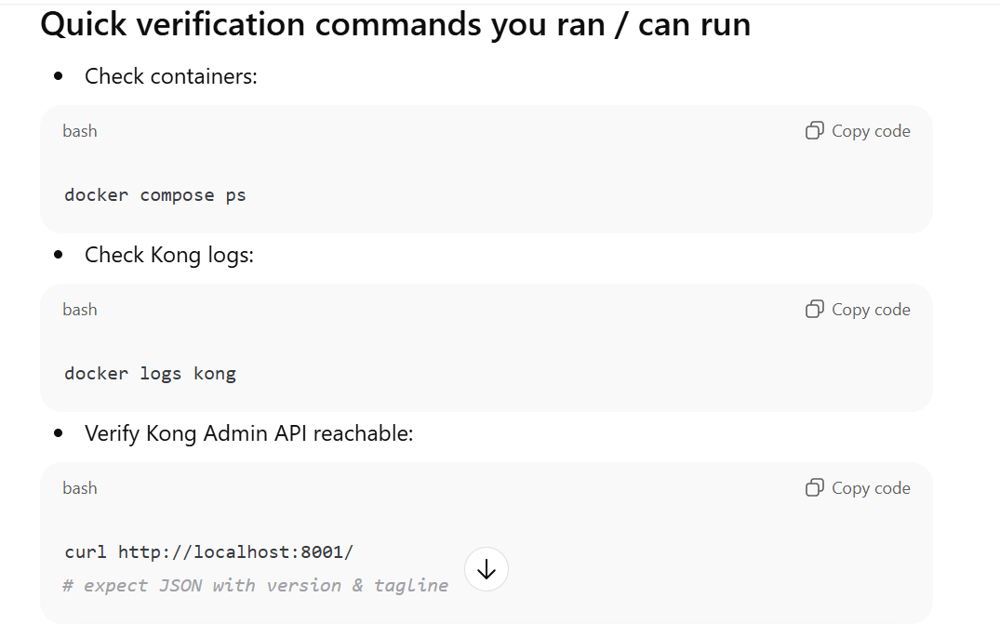

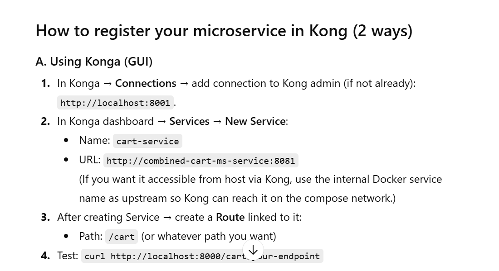
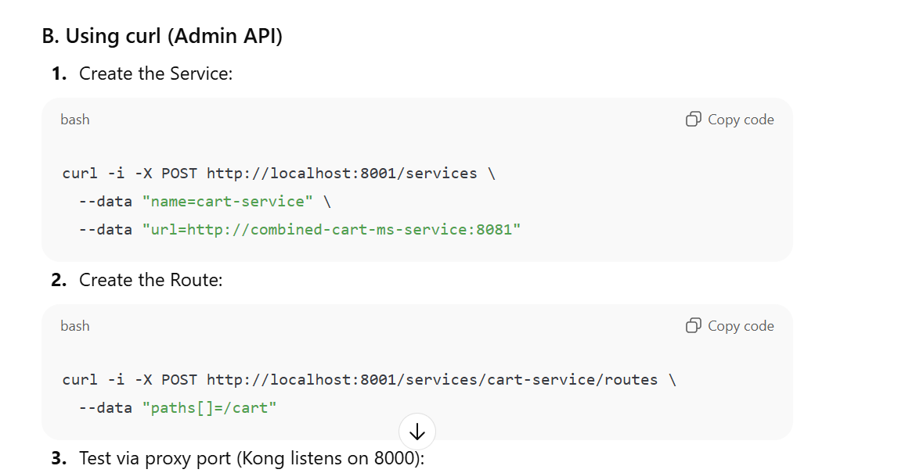
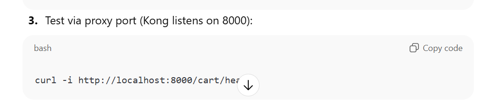
# now am able to swa the kongo UI

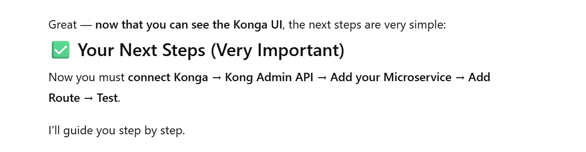
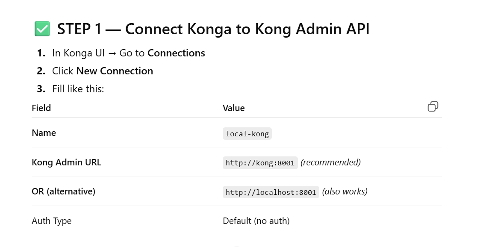
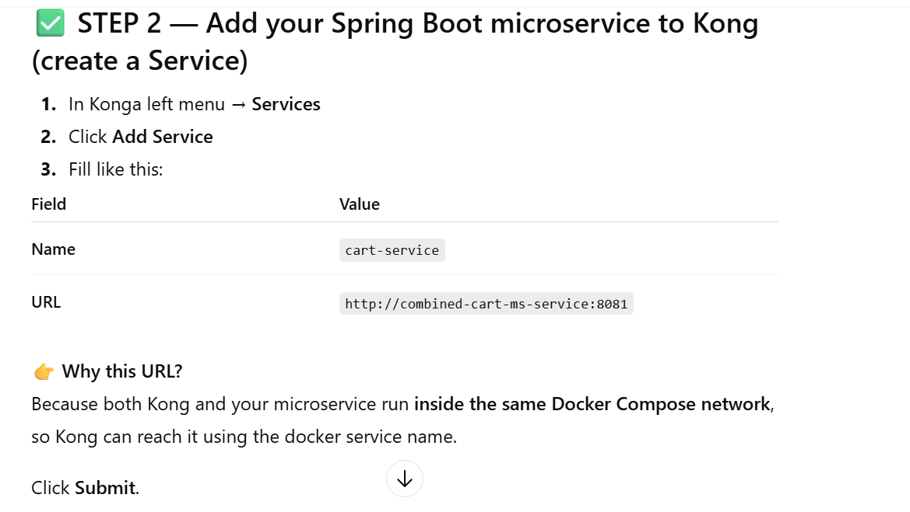
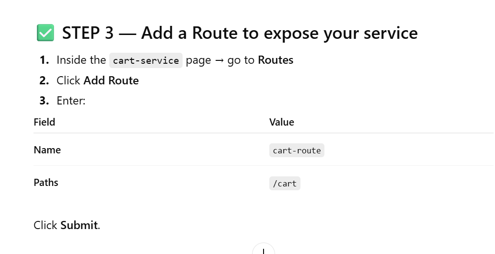
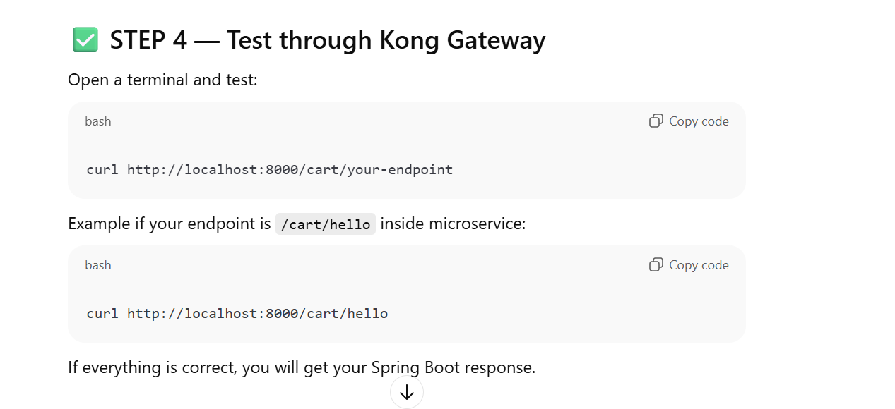
